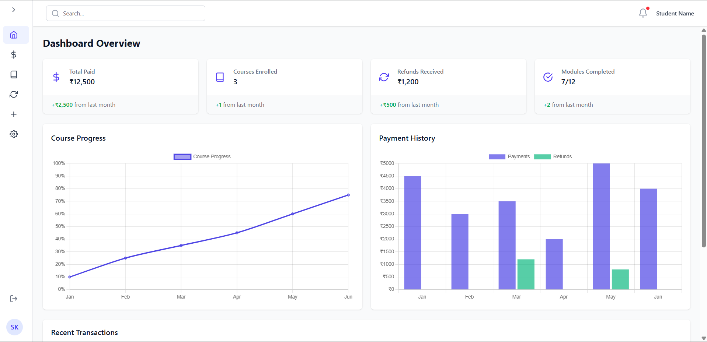
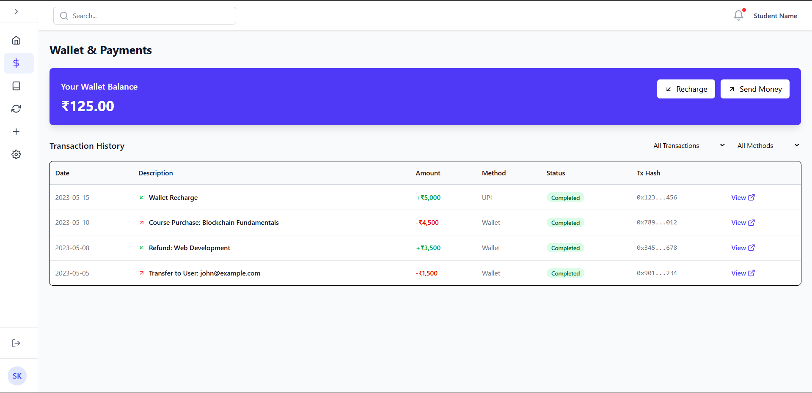
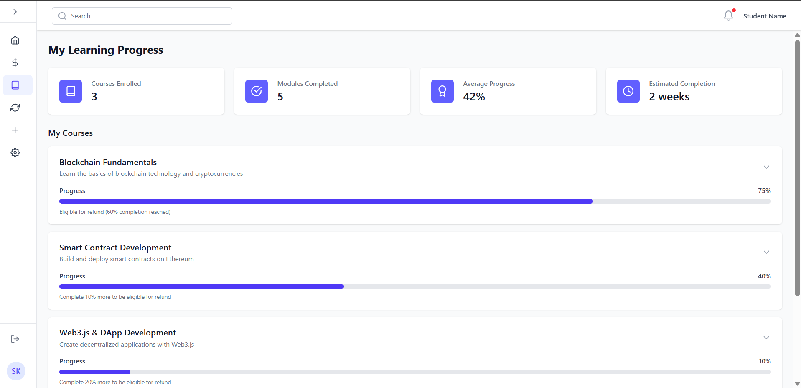
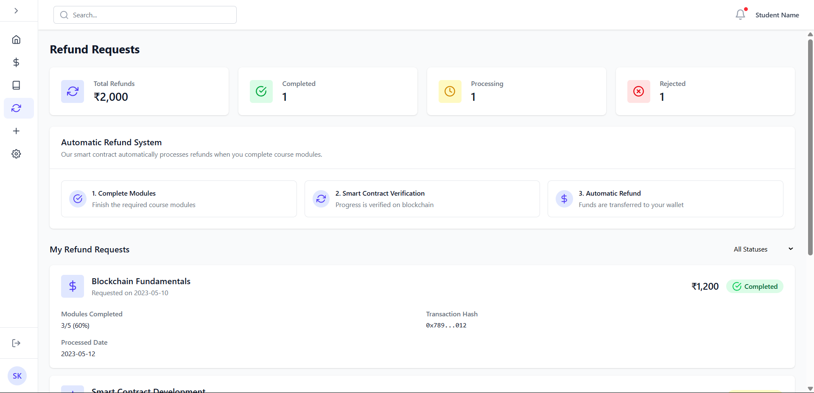
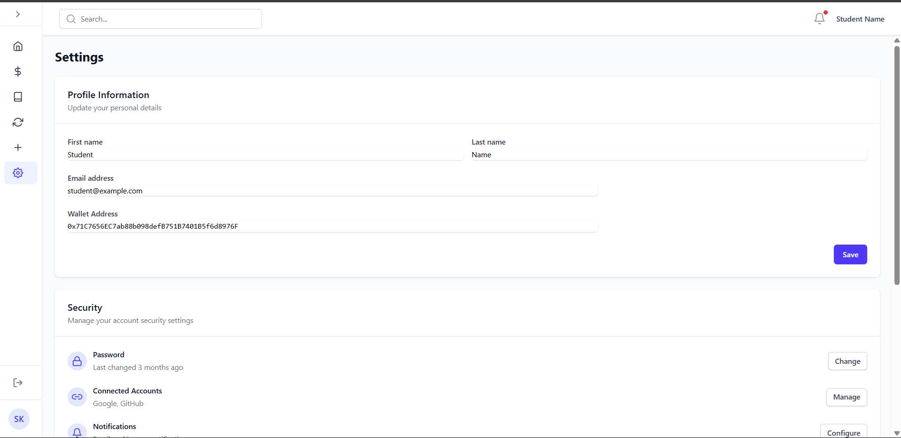

# 📦 Full Stack Blockchain Application

This repository contains a full-stack blockchain-integrated web application with the following structure:

- **frontend**: Vite-based React application (User Interface)
- **backend**:
  - **offchain**: Node.js/Express application handling database operations (MongoDB), authentication, and APIs
  - **onchain**: FastAPI application for blockchain-related operations (Smart Contract interactions), accessible only through the Node.js server

---

## 📁 Project Structure

```
root/
│
├── frontend/          # Vite + React + Tailwind frontend
│
└── backend/
    ├── offchain/      # Node.js server, MongoDB, REST APIs, Auth
    └── onchain/       # FastAPI app for blockchain interaction
```

---

## 🚀 Features

### ✅ Frontend (/frontend)
- Built with Vite, React, and Tailwind CSS  
- Responsive and performant UI  
- Interacts with the backend securely  
- Role-based access support (e.g., Institution, User)  

### ✅ Offchain Backend (/backend/offchain)
- Built using Node.js, Express, and MongoDB  
- Manages:
  - User authentication & authorization  
  - Data persistence (e.g., certificates, profiles)  
  - API routing and rate-limiting  
- Acts as a secure gateway to the onchain FastAPI server  

### ✅ Onchain Backend (/backend/onchain)
- Built with FastAPI  
- Handles blockchain contract calls securely  
- Exposed only internally to the Node.js app (not publicly accessible)  

---

## 🔐 Security Architecture

- The onchain service is **not directly exposed** to clients — only the Node.js server can communicate with it  
- All sensitive data is **encrypted or hashed** before being stored  
- **JWT-based auth** with route guards on both frontend and backend  

---

## 🛠️ Technologies Used

| Layer     | Tech Stack                                      |
|-----------|-------------------------------------------------|
| Frontend  | Vite, React, Tailwind CSS                       |
| Offchain  | Node.js, Express, MongoDB, Mongoose             |
| Onchain   | FastAPI, Web3.py or similar lib                 |
| Blockchain| Ethereum-compatible chain (e.g. Ganache, Polygon)|
| Others    | JWT, Axios, Bcrypt, Dotenv                      |

---

## 📦 Installation

### Clone the repo
```bash
git clone https://github.com/Mahaveer1013/Refunded-Based-Learning-Platform.git
cd Refunded-Based-Learning-Platform
```

### 💻 Frontend Setup
```bash
cd frontend
npm install
npm run dev
```

### 🧠 Offchain Backend Setup (Node.js)
```bash
cd backend/offchain
npm install
# Add your environment variables to `.env` using .env.example
npm start
```

Example `.env` file:
```bash
Refer .env.example file 
```

### ⛓️ Onchain Backend Setup (FastAPI)
```bash
cd backend/onchain
pip install -r requirements.txt
# Cors configured to allow only the node application provided in the same repo
# Add your environment variables to `.env` using .env.example
python.exe main.py
```

---

## 🔗 API Gateway Logic

Only the Node.js server is allowed to call the FastAPI blockchain endpoints using internal network calls.  
This adds a layer of abstraction and security.

---

## 📄 Sample API Flow

1. Frontend sends a request to `/api/offchain/certificate`
2. Node.js validates auth, processes business logic
3. For onchain operations (e.g., upload hash to blockchain), Node.js makes an internal request to FastAPI
4. Response is returned to frontend after final processing

---

## 📷 Screenshots







---

## 📘 License

MIT License. See [LICENSE](LICENSE) for details.

---

## 🤝 Contributing

Pull requests are welcome. For major changes, please open an issue first.

---

## 📢 Contact

**Your Name** – mahaveer30032005@gmail.com  
**GitHub**: [@mahaveer1013](https://github.com/mahaveer1013)  
**Portfolio**: [www.mahaveer.dev](https://www.mahaveer.dev)

